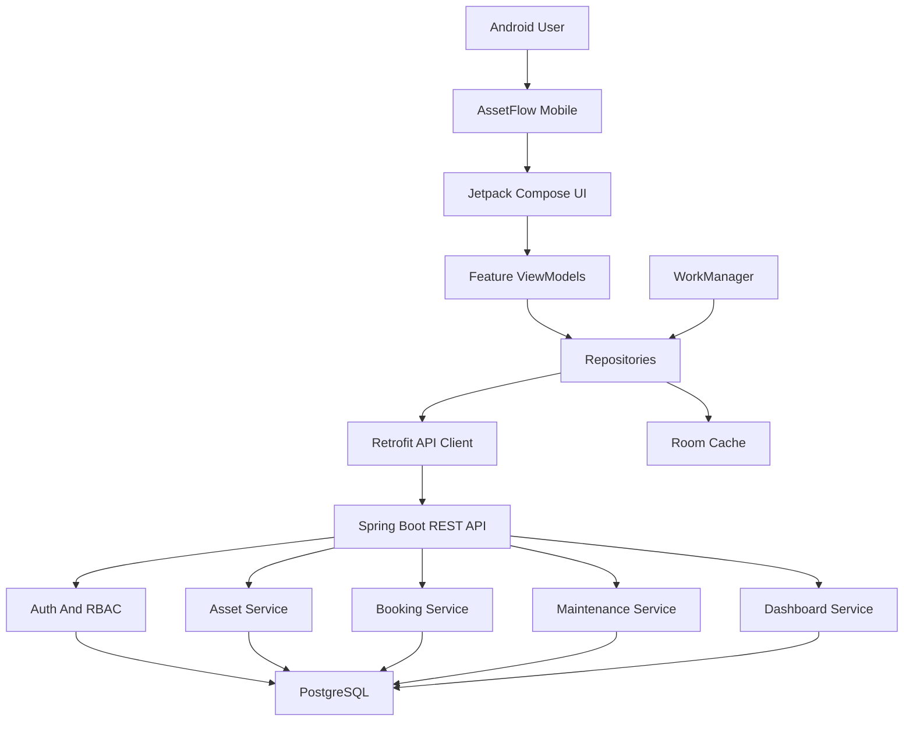
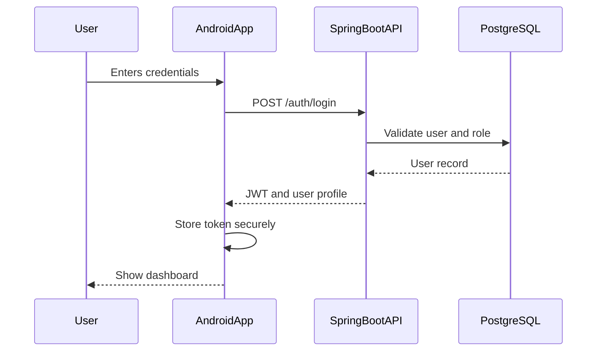
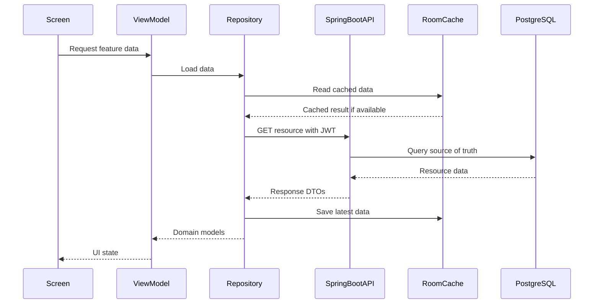
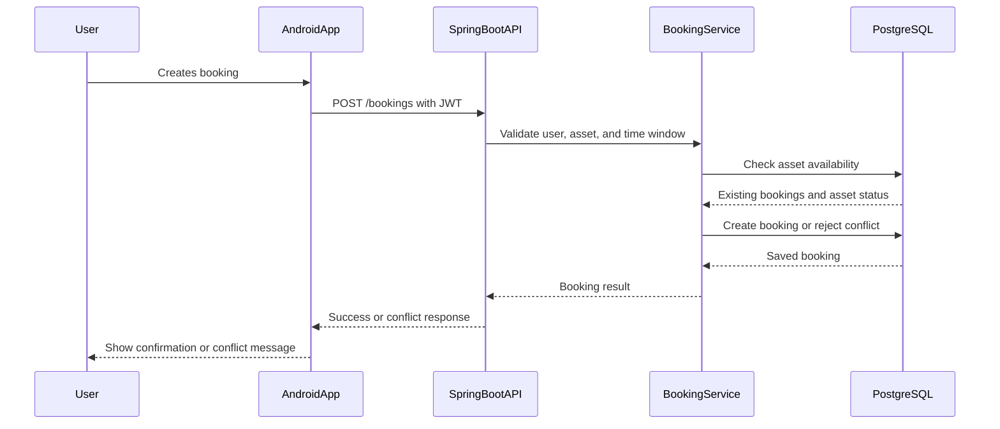

# Architecture

## Stack

AssetFlow Mobile uses a client-server architecture.

### Mobile App

- Platform: Native Android
- Language: Kotlin
- UI: Jetpack Compose
- App architecture: MVVM
- API client: Retrofit
- Local persistence: Room Database
- Background work: WorkManager
- Authentication: JWT access token from backend APIs

### Backend

- Java Spring Boot
- RESTful APIs
- JWT authentication and authorization
- Role-based access control
- Business logic for assets, bookings, maintenance, notifications, and dashboards

### Database

- PostgreSQL
- Stores users, organizations, assets, bookings, maintenance records, notifications, and audit information

---

## Folder Structure

This is the intended Android app structure. Keep feature code grouped by domain and shared infrastructure in common packages.

```
app/
  src/main/java/com/assetflow/mobile/
    core/
      data/
        local/
          dao/
          database/
          entity/
        remote/
          api/
          dto/
          interceptor/
        repository/
      domain/
        model/
        util/
      navigation/
      ui/
        components/
        theme/
      worker/
    features/
      auth/
        data/
        domain/
        presentation/
      dashboard/
        data/
        domain/
        presentation/
      assets/
        data/
        domain/
        presentation/
      bookings/
        data/
        domain/
        presentation/
      maintenance/
        data/
        domain/
        presentation/
      notifications/
        data/
        domain/
        presentation/
```

---

## System Boundaries

### Mobile Application Boundary

The Android app owns:

- Jetpack Compose screens and UI state
- User session storage on device
- API request and response mapping
- Local cache for frequently used data
- Background reminders and sync work
- Navigation between app features

The Android app does not own:

- Business authorization decisions
- Booking conflict validation as the final source of truth
- Permanent asset, booking, maintenance, or audit records
- Cross-user notification delivery rules

### Backend Boundary

The Spring Boot backend owns:

- Authentication and JWT issuing
- Role-based access control
- Asset lifecycle rules
- Booking approval and conflict detection
- Maintenance scheduling rules
- Dashboard aggregation
- Audit trail creation

### Database Boundary

PostgreSQL is the source of truth for:

- User and role records
- Organization data
- Asset records
- Booking records
- Maintenance records
- Notification records
- Audit information

Room Database is only a mobile cache. It must not be treated as the source of truth for shared organizational state.

---

## High-Level Architecture



---

## Core Domains

### Authentication

Handles registration, login, JWT storage, logout, and role-aware access to features.

Primary records:

- User
- Role
- Organization
- Auth token

### Assets

Handles asset listing, search, details, status, and availability display.

Primary records:

- Asset
- Asset category
- Asset status
- Asset location

### Bookings

Handles booking creation, booking history, cancellation, approval workflow, and conflict feedback.

Primary records:

- Booking
- Booking status
- Approval decision
- Booking audit event

### Maintenance

Handles maintenance records, maintenance history, due dates, and scheduled alerts.

Primary records:

- Maintenance record
- Maintenance schedule
- Maintenance status

### Dashboard

Displays summary data for total assets, available assets, active bookings, maintenance due, and utilization.

Dashboard values should be calculated by the backend so the mobile app displays trusted aggregate data.

### Notifications

Displays booking approvals, return reminders, maintenance alerts, and system announcements.

Notifications can be stored in PostgreSQL and surfaced through API reads. WorkManager can schedule local reminders when the backend provides due dates or notification windows.

---

## Data Flow

### Login Flow



### Read Data Flow



### Booking Mutation Flow



---

## API Responsibilities

The mobile app should communicate with the backend through REST endpoints grouped by domain.

Expected API groups:

- `/auth` for registration, login, logout, and session validation
- `/users` for profile and role-aware user data
- `/assets` for asset listing, search, details, and availability
- `/bookings` for booking creation, history, cancellation, and approvals
- `/maintenance` for records, schedules, and maintenance status
- `/dashboard` for mobile dashboard summaries
- `/notifications` for user notifications and reminders

All protected requests must include a valid JWT. The backend must verify user identity, organization access, and role permissions before returning or mutating data.

---

## Local Storage Rules

Room Database may cache:

- Asset lists and asset details
- Booking history for the signed-in user
- Maintenance records relevant to visible assets
- Dashboard summary snapshots
- Notification history

Room Database must not cache:

- Plain text passwords
- Long-lived secrets
- Authorization decisions as permanent truth
- Shared records in a way that bypasses backend validation

Session tokens should be stored using Android secure storage patterns rather than plain Room entities.

---

## Background Work

Use WorkManager for mobile-side background tasks such as:

- Asset return reminders
- Maintenance due reminders
- Periodic refresh of cached data
- Retry of safe network sync operations

WorkManager should not create final booking, maintenance, or approval decisions without backend confirmation.

---

## Security Rules

- Use JWT for authenticated API requests.
- Enforce role-based access control on the backend, not only in the mobile UI.
- Validate booking conflicts on the backend before persisting bookings.
- Scope all user-visible records by organization and role.
- Do not store sensitive credentials in local database tables.
- Treat mobile input as untrusted and validate every mutation on the backend.

---

## Architecture Principle

The mobile app should be responsive and useful on Android devices, but the backend remains the source of truth. UI state, local cache, and background reminders should improve the user experience without replacing backend validation or PostgreSQL records.

---